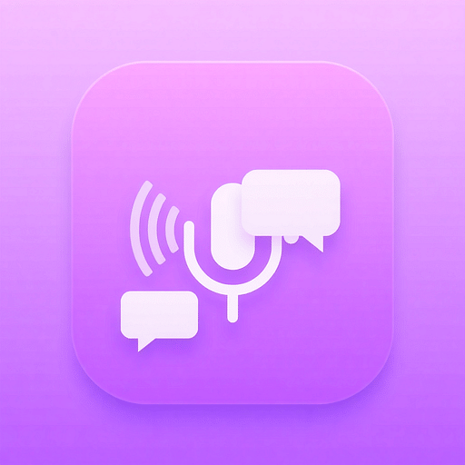
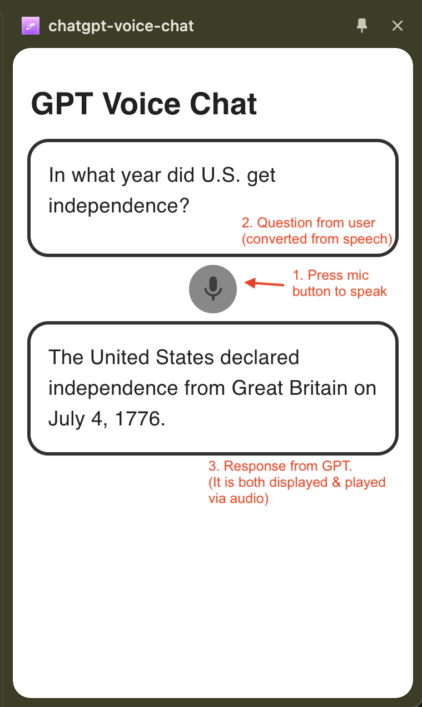

# chatgpt-voice-chat

Chrome Extension for initiating a voice chat with ChatGPT.


This is a React based app, and uses the following ChatGPT APIs:

-   Speech to text
-   Text prompt to Text Response
-   Text Response to Audio

The extension runs as a sidebar, which persists through various browser tabs.



## Build and Run

### 1. Setup ChatGPT API Key

-   Start by obtaining an API key from ChatGPT. Follow the steps listed on https://www.merge.dev/blog/chatgpt-api-key

-   Rename the existing `.env.example` file to `.env` and put the chat-gpt api key. It will look
    like:
    ```
    OPEN_API_KEY="<your-chat-gpt-api-key>"
    ```

### 2) Build and Deploy

For this step, choose either the development build, or production build.

#### a) Development Build

1. Check if your [Node.js](https://nodejs.org/) version is >= **20**

2. Run `npm install` to install the dependencies.

3. Run `npm start`

4. Load your extension on Chrome following:
    1. Access `chrome://extensions/`
    2. Check `Developer mode`
    3. Click on `Load unpacked extension`
    4. Select the `dist` folder.

#### b) Production Build

1. Stop the development script (if it is running)
2. Run `npm run build`
3. Load your extension on Chrome following:
    1. Access `chrome://extensions/`
    2. Check `Developer mode`
    3. Click on `Load unpacked extension`
    4. Select the `dist` folder

